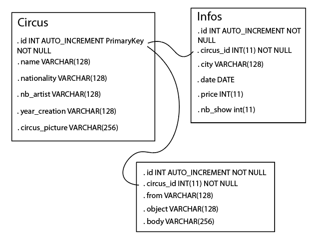

User Story:

- 1- En tant qu'utilisateur je veux pourvoir consulter les cirques de la compagnie. (GET)OKOKOKOKOK
- 2- Je veux pouvoir consulter les informations des cirques. (GET)OKOKOKOKOK
- 3- je veux pouvoir modifier les informations d'un cirque. (PUT)OKOKOK
- 4- je veux pouvoir consulter un cirque par l'id. (GET) OKOKOK
- 5- je veux pouvoir ajouter un cirque à la compagnie. (POST) OKOKOKOK
- 6- je veux pouvoir supprimer un cirque de la compagnie. (DELETE)OKOOK
- 7- je veux pouvoir envoyer un message à un cirque. (POST) OKOKOKOK
- 8- je veux pouvoir lire les messages d'un cirque. (GET)OKOKOKOK
- 9- Ajouter infos aux cirques OKOKOK
- 10- je veux pouvoir supprimer un message. (DELETE)OKOKOKOK

Data base:

